# LLM Integration in Robotics Diagram

## Diagram Information

**Title**: LLM Integration in Robotics: Capabilities and Safety Boundaries

**Type**: system-diagram

**Description**: This diagram illustrates the integration of Large Language Models in robotic systems, showing both the potential applications and the critical safety boundaries and limitations that must be maintained.

**Concepts Illustrated**: llm-robot-integration, safety-considerations, uncertainty-in-llm-outputs, capability-vs-reliability, perception-cognition-action-loop

## Diagram Content

```mermaid
graph TB
    subgraph "Human User"
        HUMAN["👤 Human User<br/>- Natural language commands<br/>- Task requests<br/>- Feedback provision"]
    end

    subgraph "LLM Integration System"
        subgraph "LLM Processing Layer"
            LLM["🤖 Large Language Model<br/>- Text generation<br/>- Planning assistance<br/>- Knowledge access<br/>- Context understanding"]
        end

        subgraph "Safety and Verification Layer"
            SAFETY_CHECK["🛡️ Safety Checker<br/>- Command validation<br/>- Safety constraints<br/>- Feasibility check<br/>- Risk assessment"]
            UNCERTAINTY_EST["📊 Uncertainty Estimator<br/>- Confidence scoring<br/>- Entropy calculation<br/>- Risk modeling<br/>- Hallucination detection"]
        end

        subgraph "Robot Control Layer"
            TASK_PLANNER["⚙️ Task Planner<br/>- High-level planning<br/>- Constraint integration<br/>- Safety boundaries<br/>- Execution sequencing"]
            MOTION_PLANNER["📐 Motion Planner<br/>- Collision avoidance<br/>- Trajectory planning<br/>- Physical constraints<br/>- Safety margins"]
        end

        subgraph "Execution Layer"
            SENSORS["👁️ Sensors<br/>- Environmental perception<br/>- Safety monitoring<br/>- Execution feedback<br/>- State estimation"]
            ACTUATORS["🦾 Actuators<br/>- Safe movement<br/>- Controlled execution<br/>- Emergency stops<br/>- Physical safety"]
        end
    end

    subgraph "Environmental Context"
        ENVIRONMENT["🌍 Environment<br/>- Objects and obstacles<br/>- Safety zones<br/>- Dynamic elements<br/>- Human presence"]
    end

    subgraph "LLM Limitations Boundary"
        LIMITATIONS["⚠️ LLM Limitations<br/>- Hallucinations<br/>- Latency issues<br/>- Embodiment gap<br/>- Real-time constraints"]
    end

    HUMAN --> LLM
    LLM --> SAFETY_CHECK
    LLM --> UNCERTAINTY_EST
    SAFETY_CHECK --> TASK_PLANNER
    UNCERTAINTY_EST --> TASK_PLANNER
    TASK_PLANNER --> MOTION_PLANNER
    MOTION_PLANNER --> ACTUATORS
    SENSORS --> TASK_PLANNER
    SENSORS --> MOTION_PLANNER
    SENSORS --> SAFETY_CHECK
    ACTUATORS --> SENSORS
    ENVIRONMENT -.-> LLM
    ENVIRONMENT -.-> SAFETY_CHECK
    ENVIRONMENT -.-> TASK_PLANNER
    ENVIRONMENT -.-> MOTION_PLANNER
    LIMITATIONS -.-> LLM
    LIMITATIONS -.-> SAFETY_CHECK

    FEEDBACK["🔄 Feedback Loop<br/>- Execution status<br/>- User feedback<br/>- Safety alerts<br/>- Performance metrics"]
    ACTUATORS --> FEEDBACK
    FEEDBACK --> SENSORS
    FEEDBACK --> LLM
    FEEDBACK --> SAFETY_CHECK

    subgraph "Human-in-the-Loop"
        HUMAN_SUPERVISION["👨‍🔧 Human Supervision<br/>- Override capability<br/>- Intervention authority<br/>- Final decision maker<br/>- Safety backup"]
    end

    HUMAN_SUPERVISION -.-> TASK_PLANNER
    HUMAN_SUPERVISION -.-> SAFETY_CHECK
```



## Mathematical Explanation

The LLM integration system can be represented mathematically as:

```
Robot_Action = Execute(Plan(LLM_Response(Context, Command), Safety_Filters))
```

Where:
- Robot_Action is the final action executed by the robot
- Plan is the task planning function
- LLM_Response is the LLM output given context and command
- Safety_Filters are the safety constraints applied

The uncertainty in LLM responses can be quantified as:

```
Uncertainty(LLM_Output) = H(P) = -∑ p_i * log(p_i)
```

Where H(P) is the entropy of the probability distribution over possible outputs.

The safety verification function can be expressed as:

```
Safety_Score = f(Command, Robot_State, Environment, LLM_Uncertainty)
```

Where the safety score determines whether the LLM-generated plan should be approved for execution.

The risk-adjusted execution probability:

```
P(execute | LLM_output, context) = sigmoid(W_risk * Risk_Features + b_risk) * Safety_Multiplier
```

## Figure Notes

**Educational Purpose**: This diagram helps students visualize how LLMs can be integrated into robotic systems while maintaining safety boundaries and understanding limitations.

**Key Elements**:
- The clear separation between LLM capabilities and robot execution
- Safety and verification layers that mediate between LLM and robot
- The boundary highlighting LLM limitations that must be respected
- The human-in-the-loop supervision for critical decisions

**Common Misconceptions**:
- Students might think LLMs can directly control robots without safety checks
- The system requires multiple safety layers between LLM and physical execution
- Uncertainty quantification is critical for safe operation

**Related Content**:
- This connects to the broader perception-cognition-action loop
- Uncertainty mathematics are detailed in T044
- Safety considerations are expanded in T043
- Pseudo-code examples demonstrate the workflow in T042

## APA Citation for Source

- Brohan, A., Brown, N., Carbajal, J., Chebotar, Y., Dora, C., Finn, C., ... & Welker, K. (2022). RT-1: Robotics transformer for real-world control at scale. arXiv preprint arXiv:2212.06817.
- Ahn, H., Du, Y., Kolve, E., Gupta, A., & Gupta, S. (2022). Do as i can, not as i say: Grounding embodied agents with human demonstrations. arXiv preprint arXiv:2206.10558.

---

*Note: This diagram follows ADR-002 requirements by providing both visual and mathematical explanations for conceptual understanding.*