# Multimodal Interaction System Diagram

## Diagram Information

**Title**: Multimodal Interaction System: Speech, Gesture, and Vision Integration

**Type**: system-diagram

**Description**: This diagram illustrates the architecture of a multimodal human-robot interaction system, showing how speech, gesture, and vision inputs are processed and integrated to enable natural human-robot communication.

**Concepts Illustrated**: human-robot-interaction-vla, multimodal-integration, cross-modal-attention, perception-cognition-action-loop

## Diagram Content

```mermaid
graph TB
    subgraph "Human User"
        SPEECH["🗣️ Speech Input<br/>- Natural language commands<br/>- Prosodic features<br/>- Emotional tone"]
        GESTURE["👋 Gesture Input<br/>- Hand movements<br/>- Pointing actions<br/>- Body posture"]
        GAZE["👁️ Gaze Direction<br/>- Visual attention<br/>- Object reference<br/>- Social cues"]
    end

    subgraph "Multimodal Integration System"
        subgraph "Input Processing Layer"
            ASR["🎤 Speech Processing<br/>- Automatic speech recognition<br/>- Language parsing<br/>- Intent extraction"]
            GESTURE_RECOG["✋ Gesture Recognition<br/>- Movement analysis<br/>- Hand tracking<br/>- Action classification"]
            VISION_PROC["👁️ Vision Processing<br/>- Object detection<br/>- Scene understanding<br/>- Human pose estimation"]
        end

        subgraph "Integration Layer"
            FUSION["🔄 Multimodal Fusion<br/>- Cross-modal attention<br/>- Feature alignment<br/>- Context integration"]
            GROUNDING["🎯 Multimodal Grounding<br/>- Speech-gesture alignment<br/>- Vision-language mapping<br/>- Contextual disambiguation"]
        end

        subgraph "Response Generation Layer"
            UNDERSTANDING["🧠 Situational Understanding<br/>- Intent interpretation<br/>- Context awareness<br/>- Social reasoning"]
            RESPONSE_PLANNING["💬 Response Planning<br/>- Verbal responses<br/>- Social behaviors<br/>- Action coordination"]
        end

        subgraph "Output Layer"
            VERBAL_RESPONSE["💬 Verbal Response<br/>- Speech synthesis<br/>- Feedback provision<br/>- Clarification requests"]
            GESTURAL_RESPONSE["✋ Gestural Response<br/>- Acknowledgment gestures<br/>- Pointing responses<br/>- Social signals"]
            ROBOT_ACTION["🤖 Robot Action<br/>- Navigation<br/>- Manipulation<br/>- Task execution"]
        end
    end

    subgraph "Environmental Context"
        OBJECTS["🏠 Objects & Environment<br/>- Physical objects<br/>- Spatial layout<br/>- Dynamic elements"]
    end

    SPEECH --> ASR
    GESTURE --> GESTURE_RECOG
    GAZE --> VISION_PROC
    ASR --> FUSION
    GESTURE_RECOG --> FUSION
    VISION_PROC --> FUSION
    FUSION --> GROUNDING
    GROUNDING --> UNDERSTANDING
    UNDERSTANDING --> RESPONSE_PLANNING
    RESPONSE_PLANNING --> VERBAL_RESPONSE
    RESPONSE_PLANNING --> GESTURAL_RESPONSE
    RESPONSE_PLANNING --> ROBOT_ACTION
    OBJECTS -.-> VISION_PROC
    OBJECTS -.-> GROUNDING
    OBJECTS -.-> UNDERSTANDING

    FEEDBACK["🔄 Feedback Loop<br/>- User response<br/>- Interaction adaptation<br/>- Learning from interaction"]
    VERBAL_RESPONSE --> FEEDBACK
    GESTURAL_RESPONSE --> FEEDBACK
    ROBOT_ACTION --> FEEDBACK
    FEEDBACK --> ASR
    FEEDBACK --> GESTURE_RECOG
    FEEDBACK --> VISION_PROC
```



## Mathematical Explanation

The multimodal interaction system can be represented mathematically as:

```
M(t) = Fusion(S(t), G(t), V(t), C)
```

Where:
- M(t) is the multimodal representation at time t
- S(t) is the speech modality representation at time t
- G(t) is the gesture modality representation at time t
- V(t) is the vision modality representation at time t
- C is the contextual information

The fusion process involves attention mechanisms between modalities:

```
Attention(S, G, V) = softmax((Q_S K_G^T)/√d_k) V_G + softmax((Q_S K_V^T)/√d_k) V_V + ...
```

Where Q, K, V are query, key, and value matrices for each modality.

The probability distribution over possible interpretations given multimodal input:

```
P(interpretation | speech, gesture, vision) = softmax(W_o * MultimodalAttention(speech, gesture, vision))
```

## Figure Notes

**Educational Purpose**: This diagram helps students visualize how different modalities (speech, gesture, vision) are processed and integrated in human-robot interaction systems.

**Key Elements**:
- The three main input modalities (speech, gesture, vision) and their processing
- The fusion layer where modalities are integrated
- The response generation that creates appropriate robot behaviors
- The feedback loop that enables adaptive interaction

**Common Misconceptions**:
- Students might think modalities operate independently; the diagram shows their integration
- The system requires coordination between multiple processing streams

**Related Content**:
- This connects to the broader perception-cognition-action loop
- Multimodal fusion mathematics are detailed in T036
- Pseudo-code examples demonstrate the workflow in T034

## APA Citation for Source

- Thomason, J., Bisk, Y., & Khosla, A. (2019). Shifting towards task completion with touch in multimodal conversational interfaces. arXiv preprint arXiv:1909.05288.
- Fong, T., Nourbakhsh, I., & Dautenhahn, K. (2003). A survey of socially interactive robots. Robotics and autonomous systems, 42(3-4), 143-166.

---

*Note: This diagram follows ADR-002 requirements by providing both visual and mathematical explanations for conceptual understanding.*