# VLA System Architecture Diagram

## Diagram Information

**Title**: VLA System Architecture: Perception-Cognition-Action Flow

**Type**: system-diagram

**Description**: This diagram illustrates the architecture of Vision-Language-Action (VLA) systems, showing how visual perception, language understanding, and motor action components interact in a humanoid robot system.

**Concepts Illustrated**: vla-system, perception-cognition-action-loop, multimodal-integration, cross-modal-attention

## Diagram Content

```mermaid
graph TB
    subgraph "Human User"
        HUMAN["🗣️ Natural Language Command"]
    end

    subgraph "VLA System Architecture"
        subgraph "Perception Layer"
            VISION["👁️ Vision Processing<br/>- Camera sensors<br/>- Feature extraction<br/>- Object detection"]
            LANGUAGE_PERC["🗣️ Language Processing<br/>- Speech recognition<br/>- NLP parsing<br/>- Intent extraction"]
        end

        subgraph "Cognition Layer"
            CROSS_ATTENTION["🔄 Cross-Modal Attention<br/>- Visual-language fusion<br/>- Attention mechanisms<br/>- Context integration"]
            REASONING["🧠 Reasoning Engine<br/>- Task planning<br/>- Context awareness<br/>- Decision making"]
        end

        subgraph "Action Layer"
            MOTOR_PLANNING["⚙️ Motor Planning<br/>- Path planning<br/>- Motion planning<br/>- Action sequencing"]
            EXECUTION["🤖 Action Execution<br/>- Motor control<br/>- Navigation<br/>- Manipulation"]
        end

        FEEDBACK["🔄 Feedback Loop<br/>- Sensor data<br/>- Execution results<br/>- Environmental changes"]
    end

    HUMAN --> LANGUAGE_PERC
    VISION --> CROSS_ATTENTION
    LANGUAGE_PERC --> CROSS_ATTENTION
    CROSS_ATTENTION --> REASONING
    REASONING --> MOTOR_PLANNING
    MOTOR_PLANNING --> EXECUTION
    EXECUTION --> FEEDBACK
    FEEDBACK --> VISION
    FEEDBACK --> CROSS_ATTENTION
    FEEDBACK --> REASONING
    FEEDBACK --> MOTOR_PLANNING
```



## Mathematical Explanation

The VLA system can be represented as:

```
S(t) = f(V(t), L(t), A(t-1), H)
```

Where:
- S(t) is the system state at time t
- V(t) represents visual input at time t
- L(t) represents language input at time t
- A(t-1) represents previous actions
- H represents historical context

The cross-modal attention mechanism can be expressed as:

```
Attention(Q, K, V) = softmax((QK^T)/√d_k)V
```

Where Q (queries) come from one modality, K (keys) and V (values) from another, enabling information flow between vision and language components.

## Figure Notes

**Educational Purpose**: This diagram helps students visualize how different components of a VLA system work together to process multimodal inputs and generate appropriate actions.

**Key Elements**:
- The three main layers (Perception, Cognition, Action) showing the flow from input to output
- The feedback loop showing how the system adapts based on execution results
- The cross-modal attention component that integrates vision and language

**Common Misconceptions**:
- Students might think these components operate independently; the diagram shows their interconnections
- The feedback loop is essential for adaptive behavior, not just a simple feedforward process

**Related Content**:
- This architecture connects to the perception-cognition-action loop concept
- Cross-modal attention mechanisms are detailed in the mathematical explanation
- Pseudo-code examples demonstrate the workflow in T018

## APA Citation for Source

- Ahn, H., Du, Y., Kolve, E., Gupta, A., & Gupta, S. (2022). Do as i can, not as i say: Grounding embodied agents with human demonstrations. arXiv preprint arXiv:2206.10558.
- Reed, K., Vu, T. T., Paine, T. L., Brohan, A., Joshi, S., Valenzuela-Escárcega, M. A., ... & Le, Q. V. (2022). A generalist agent. Transactions on Machine Learning Research.

---

*Note: This diagram follows ADR-002 requirements by providing both visual and mathematical explanations for conceptual understanding.*