# Voice-to-Action Pipeline Diagram

## Diagram Information

**Title**: Voice-to-Action Pipeline: From Speech Input to Robot Action Execution

**Type**: process-flow

**Description**: This diagram illustrates the complete pipeline for processing voice commands and translating them into robot actions, showing the flow from speech input through cognitive processing to motor execution.

**Concepts Illustrated**: language-understanding, action-planning, perception-cognition-action-loop, llm-robot-integration, human-robot-interaction-vla

## Diagram Content

```mermaid
graph TD
    subgraph "Human User"
        SPEECH["🗣️ Speech Command<br/>- Natural language input<br/>- 'Please bring me the red cup'"]
    end

    subgraph "Voice-to-Action Pipeline"
        subgraph "Perception Layer: Speech Processing"
            ASR["🎤 Automatic Speech Recognition<br/>- Audio to text conversion<br/>- Speech-to-text models<br/>- Noise filtering"]
            TOKENIZATION["📝 Tokenization<br/>- Text to tokens<br/>- Language model input<br/>- Context preparation"]
        end

        subgraph "Cognition Layer: Intent Processing"
            EMBEDDING["🧠 Embedding Generation<br/>- Semantic representations<br/>- Contextual vectors<br/>- Meaning encoding"]
            INTENT_RECOGNITION["🎯 Intent Recognition<br/>- Command classification<br/>- Object identification<br/>- Action determination"]
            PLANNING["⚙️ Action Planning<br/>- Task decomposition<br/>- Sequence generation<br/>- Constraint checking"]
        end

        subgraph "Action Layer: Execution"
            MOTOR_COMMANDS["🤖 Motor Commands<br/>- Navigation planning<br/>- Manipulation sequences<br/>- Safety checks"]
            EXECUTION["⚡ Action Execution<br/>- Physical movement<br/>- Environmental interaction<br/>- Real-time adjustments"]
        end

        FEEDBACK["🔄 Feedback Loop<br/>- Execution status<br/>- Success confirmation<br/>- Error handling"]
    end

    SPEECH --> ASR
    ASR --> TOKENIZATION
    TOKENIZATION --> EMBEDDING
    EMBEDDING --> INTENT_RECOGNITION
    INTENT_RECOGNITION --> PLANNING
    PLANNING --> MOTOR_COMMANDS
    MOTOR_COMMANDS --> EXECUTION
    EXECUTION --> FEEDBACK
    FEEDBACK --> INTENT_RECOGNITION
    FEEDBACK --> PLANNING
    FEEDBACK --> MOTOR_COMMANDS

    subgraph "External Context"
        ENVIRONMENT["🏠 Environment<br/>- Object locations<br/>- Obstacle maps<br/>- Task context"]
    end

    ENVIRONMENT -.-> EMBEDDING
    ENVIRONMENT -.-> INTENT_RECOGNITION
    ENVIRONMENT -.-> PLANNING
    ENVIRONMENT -.-> MOTOR_COMMANDS
```



## Mathematical Explanation

The voice-to-action process can be represented as a sequence of transformations:

```
S → T → E → I → A → M
```

Where:
- S: Speech signal s(t) ∈ R^T (audio waveform over time)
- T: Text output T = ASR(S) (automatic speech recognition)
- E: Embedding vector E = f_embed(T) ∈ R^d (semantic representation)
- I: Intent vector I = f_intent(E, C) ∈ R^n (intent classification with context)
- A: Action sequence A = Plan(I, Env) (action planning with environment)
- M: Motor commands M = Execute(A) (motor execution)

The probability distribution over possible intents given the input can be expressed as:

```
P(intent | speech, context) = softmax(W_o * Attention(Q, K, V))
```

Where Q, K, V are computed from the speech embedding and contextual information.

## Figure Notes

**Educational Purpose**: This diagram helps students visualize the complete pipeline from voice command to robot action, showing how different system components work together.

**Key Elements**:
- The three main layers (Perception, Cognition, Action) showing the flow from speech to action
- The feedback loop showing how execution results influence future processing
- The external context providing environmental information

**Common Misconceptions**:
- Students might think speech recognition is 100% accurate; the diagram shows error handling through feedback
- The process involves complex context integration, not just simple keyword matching

**Related Content**:
- This pipeline connects to the broader perception-cognition-action loop
- Embedding and attention mechanisms are detailed in the mathematical explanation
- Pseudo-code examples demonstrate the workflow in T026

## APA Citation for Source

- Thomason, J., Bisk, Y., & Khosla, A. (2019). Shifting towards task completion with touch in multimodal conversational interfaces. arXiv preprint arXiv:1909.05288.
- OpenAI. (2023). GPT-4 Technical Report. OpenAI.

---

*Note: This diagram follows ADR-002 requirements by providing both visual and mathematical explanations for conceptual understanding.*